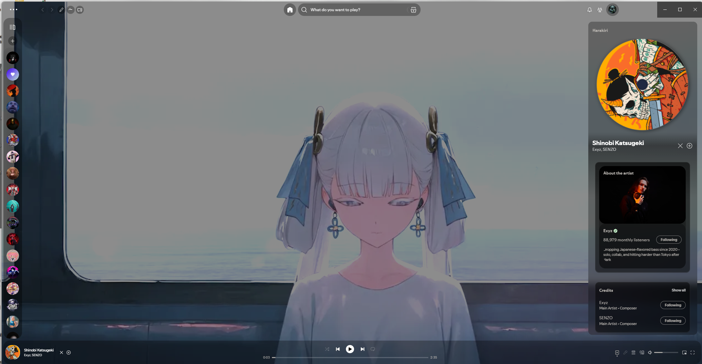
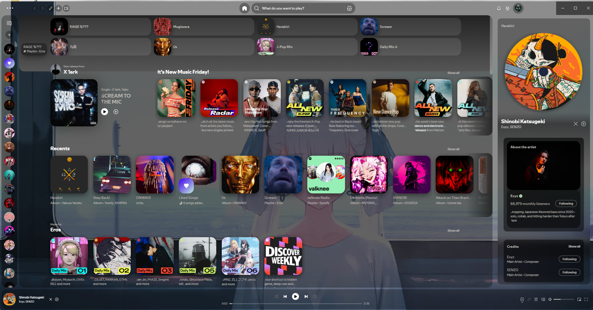
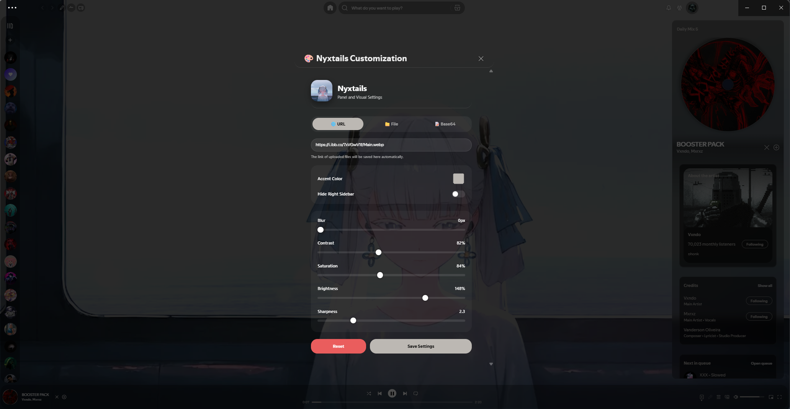

# 🎨 Nyxtails - Spicetify Theme

A sleek, modern, highly customizable transparent theme for **Spotify** using **Spicetify**. **Nyxtails** features audio-reactive background animations, vinyl-spinning album art, custom controls, and real-time visual adjustments.

---

## ✨ Features

- 📹 **Dynamic Backgrounds**: Supports Video (`.mp4`, `.webm`), static Images (URL, local file upload, or Base64).
- 🎵 **Audio-Reactive Background Zoom**: Real-time BPM and bass-reactive zoom & speed dynamic scaling synced with Spotify track analysis.
- 💿 **Vinyl Record Art Effect**: Animated spinning album art cover that spins seamlessly when music is playing and pauses when stopped.
- 🎨 **Live Customization Panel**:
  - **Accent Color Picker**: Dynamically change theme highlight color.
  - **Visual Filters**: Adjust Blur, Contrast, Saturation, Brightness, and Sharpness on the fly.
  - **Hide Right Sidebar Toggle**: Instantly hide or show the "Now Playing" right panel.
- 👁️ **Background / Focus Mode**: Toggle main content area visibility (+ / - button in the top bar) to focus on your animated background.
- ☁️ **Cloud Upload Integration**: Easily upload local background files up to 32MB directly to cloud storage (ImgBB) right from the settings panel.

---

## 🖼️ Screenshots

### 1. Main View Hidden (Background Focus Mode)
> Toggle button hides the central Spotify main view, letting your dynamic video or image background shine through.



### 2. Main View Visible
> Standard theme layout with semi-transparent backdrop panels, rounded corners, and rotating vinyl cover art.



### 3. Settings & Customization Modal
> In-app modal accessible from the top bar to easily tweak background media, filters, colors, and sidebar toggles.



---

## 🛠️ Folder Structure

Your repository / directory structure should look like this:

```text
themes/
├── nyx/
│   ├── theme.js
│   └── user.css
```

---

## 🚀 Installation

### Prerequisites

1. Install [Spotify Desktop](https://www.spotify.com/download/).
2. Install [Spicetify CLI](https://spicetify.app/docs/getting-started).

---

### Step 1: Copy Theme Files

1. Download or clone this repository.
2. Move the **`nyx`** folder directly into your Spicetify **`Themes`** directory:

#### 🪟 Windows
Navigate to `%AppData%\spicetify\Themes\` (Press `Win + R`, paste `%AppData%\spicetify\Themes\`, and hit `Enter`).
Place the `nyx` directory here:
```text
C:\Users\<YourUsername>\AppData\Roaming\spicetify\Themes\nyx\
```

#### 🍎 macOS & 🐧 Linux
Place the `nyx` folder into:
```text
~/.config/spicetify/Themes/nyx/
```

---

### Step 2: Enable Theme via Spicetify CLI

Open your terminal (PowerShell or Command Prompt on Windows, Terminal on macOS/Linux) and run:

```bash
# Set current theme to nyx
spicetify config current_theme nyx

# Enable CSS and JS extensions injection
spicetify config inject_css 1 inject_theme_js 1 replace_colors 1 overwrite_assets 1

# Apply the changes to Spotify
spicetify apply
```

> 💡 **Tip**: Whenever Spicetify or Spotify updates, run `spicetify backup apply` or `spicetify apply` again.

---

## ⚙️ How to Use

- **Nyxtails Settings**: Click the **`Nyxtails Settings`** button in the Spotify top navigation bar to open the customization modal.
- **Background Toggle Mode**: Click the **`+` / `-`** icon in the top navigation bar to toggle main view transparency (Hide/Show playlist view).
- **Vinyl Spin**: Album art automatically spins on the player bar and sidebar whenever music starts playing.

---

## 📄 License

This project is open source and available under the [MIT License](LICENSE).
